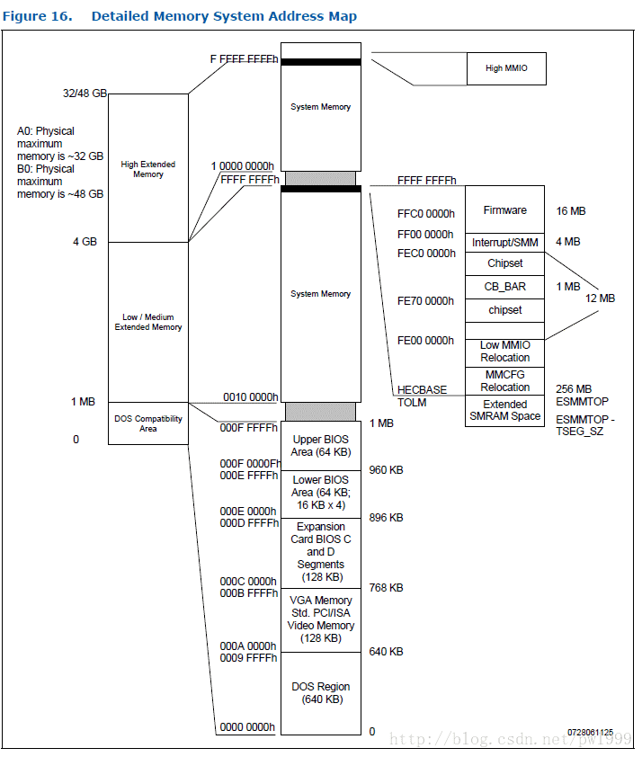
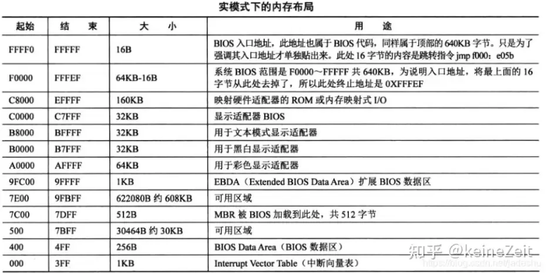
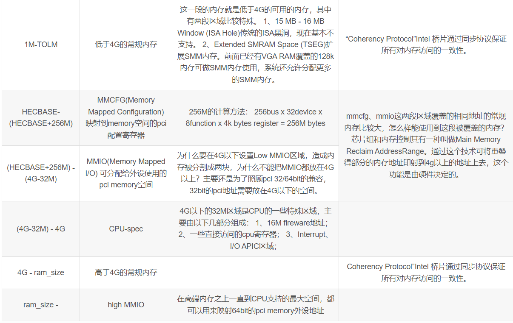

使用到的参考资料：

> - [x86 CPU地址空间分配和寄存器访问](https://blog.csdn.net/pwl999/article/details/78212508)

# 地址空间

## 0-1M 兼容空间：

### 0 - 9FFFF

0-640k常规内存

这一段区域就是ram。 其中有功能划分的区域是：起始位置的1 KB被用做BIOS中断向量表，随后的1 KB被用做BIOS数据区

### A0000 - BFFFF

640 – 768 kB Video Buffer Area

1、这一段区域是显卡的显示RAM区域，老式的VGA显示模式直接往这段显存写数据，就可以显示。现在估计只有bios阶段使用这种显示方式，系统起来后会开启更高级的显卡显示模式。
2、被显存地址覆盖的这一块128K大小的内存，可以被利用起来当做SMM内存。SMM是CPU一种等级最高的管理模式，所以它的内存在常规下不可以被访问。

1、PCI在支持VGA显示时，有个VGAEN功能，比较特殊，值得关注。VGA显卡设备不需要配置常规的pci bar寄存器地址，而只需要使能显卡所挂在PCI-PCI桥设备的配置寄存器0x3E bit 3(VGA Enable)，显卡就会响应专为VGA保留的固定pci memory地址(A0000-BFFFF)和pci io地址(03c0-03df)。

2、什么是SMM模式？ SMM是System Management Mode系统管理模式的缩写。从Intel 386SL开始，此后的x86架构微处理器中都开始支持这个模式。在这个模式中，所有正常执行的软件，包括操作系统都已经暂停运行。只有特别的单独软件，具备高特权模式的软件才能运行。通常这些软件都是一些固件程序或者是硬件辅助调试器。 x86 处理器的模式Mode模式 起始支持的处理器 Real mode Intel 8086 Protected mode Intel 80286 Virtual 8086 mode Intel 80386 Unreal mode Intel 80386 System Management Mode Intel 386SL Long mode AMD Opteron

### C0000 - EFFFF

这一段区域，是OptionRom和BIOS区域覆盖了原RAM区域。由于RAM的访问速度远远快于这些固件的访问速度，所以通常的做法是把固件中的内容拷贝到相同地址的RAM中，然后再使能RAM而屏蔽原有的固件映射。 访问BIOS和OptionRom内容和地址都没有改变，但是速度却加快了。这种做法就叫ROM Shadowing

#### C0000 - CFFFF

768 - 832 kB VGA Video BIOS ROM IDE Hard Disk BIOS ROM Optional Adapter ROM BIOS or RAM UMBs

1、这一段区域存放显卡的Option Rom还有其他设备的OptionRom（如硬盘、网卡..）。

#### D0000 - DFFFF

832 - 896 kB Optional Adapter ROM BIOS or RAM UMBs

这一段区域也是来存放设备的OptionRom。如果没有OptionRom覆盖，那就是常规内存

#### E0000 - EFFFF

896 - 960 kB System BIOS Plug and Play Extended Information

扩展BIOS区域。

## F0000 - FFFFF

960 kB–1 MB System BIOS ROM

常规BIOS区域，映射到BIOS芯片。CPU的第一句指令0xFFFF0就跳到该区域

## 1M以上的memory地址空间：

