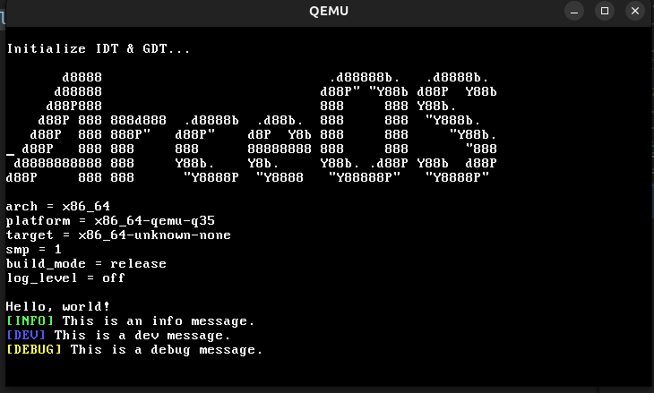
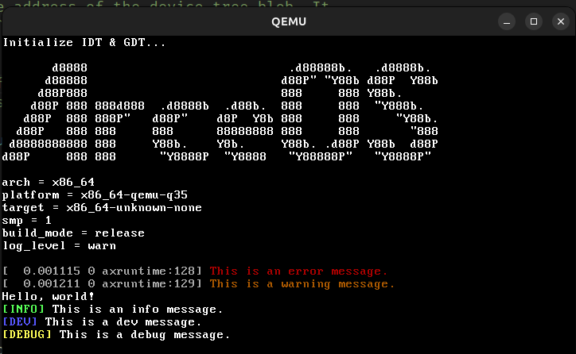

使用到的参考资料：

> 1. [ANSI转义序列](https://www.cnblogs.com/qxhn/p/10984364.html)

# 上手2 ArceOS VGA驱动/彩色显示（二）

文本变成红色，可能会是这样的序列：

```
\u{1B} [31m 这是红色的文本 \u{1B}[m
```
其中31是红色的颜色代码

相关颜色代码

```rust
pub enum ColorCode {
    Black = 30,
    Red = 31,
    Green = 32,
    Yellow = 33,
    Blue = 34,
    Magenta = 35,
    Cyan = 36,
    White = 37,
    BrightBlack = 90,
    BrightRed = 91,
    BrightGreen = 92,
    BrightYellow = 93,
    BrightBlue = 94,
    BrightMagenta = 95,
    BrightCyan = 96,
    BrightWhite = 97,
}

```

带下划线的红色文本ANSI转义码的组合

```
\u{1B}[31;4m带下划线的红色文本\u{1B}[0m
```

其中4是下划线的ANSI转义码

列举部分ANSI转义码，详见参考资料。

```rust
pub enum AnsiCode {
    Reset = 0, // 重置所有属性
    Bold = 1, // 粗体
    Italic = 3, // 斜体
    Underline = 4, //下划线
    Blink = 5, //缓慢闪烁
}
```

## 开始实验

:::details{title="实验要求"}
基于项目 https://github.com/wfly1998/arceos/tree/feature/vga

做扩展实现

参考现在的彩色实现函数

增加 pinfo ,pdev, pdebug 函数

例子： "[INFO] hello"

要求有 level 控制

例如 debug = 3 代表可以 显示info,dev,debug;

:::

根据实验要求，我们需要为上层应用程序提供三个函数`pinfo`、`pdev`、`pdebug`，同时提供对日志级别的控制`level`。


明白了终端颜色的转义码和相关属性的转义码，我们可以开始实验了。

我们分成两部分来实现：

1. `axstd`模块提供应用级别的日志输出
2. `axlog`模块提供内核级别的日志输出，同时也是`axstd`的底层实现

### 1. `axstd` 模块的颜色日志实现

我们定义：

- pinfo: 信息日志(绿色)
- pdev: 开发日志(蓝色)
- pdebug: 调试日志(黄色)

打开 `ulib/axstd/src/macros.rs`, 已经实现了`print!`和`println!`宏，核心方法是`$crate::io::__print_impl()`

```rust
#[doc(hidden)]
pub fn __print_impl(args: core::fmt::Arguments) {
    if cfg!(feature = "smp") {
        // synchronize using the lock in axlog, to avoid interleaving
        // with kernel logs
        arceos_api::stdio::ax_console_write_fmt(args).unwrap();
    } else {
        stdout().lock().write_fmt(args).unwrap();
    }
}
```
我们利用这个方法，实现`pinfo`、`pdev`、`pdebug`方法。

```rust
// ulib/axstd/src/macros.rs
#[macro_export]
macro_rules! pinfo {
    ($($arg:tt)*) => {
        //\u001b[37;42m[INFO]\u001b[0m content
        let level = option_env!("debug").unwrap_or("0").parse::<u8>().unwrap();
        //\u{1B}[96m[INFO] {} \u{1B}[0m\n
        $crate::io::__log__(level, 1, format_args!("\x1B[92m[INFO]\x1B[0m {}\n", format_args!($($arg)*)));
    };
}

#[macro_export]
macro_rules! pdev {
    //\u001b[97;44m[DEV]\u001b[0m content
    ($($arg:tt)*) => {
        //\u{1B}[97;44m[DEV]\u{1B}[m {}\n
        let level = option_env!("debug").unwrap_or("0").parse::<u8>().unwrap();
        $crate::io::__log__(level, 2, format_args!("\x1B[94m[DEV]\x1B[0m {}\n", format_args!($($arg)*)));
    };
}

#[macro_export]
macro_rules! pdebug {
    //\u001b[97;103m[DEBUG]\u001b[0m content
    ($($arg:tt)*) => {
        let level = option_env!("debug").unwrap_or("0").parse::<u8>().unwrap();
        $crate::io::__log__(level, 3, format_args!("\x1B[93m[DEBUG]\x1B[0m {}\n", format_args!($($arg)*)));
    };
}

// ulib/axstd/src/io/stdio.rs
#[doc(hidden)]
pub fn __log__(debug_level: u8, level: u8, args: core::fmt::Arguments) {
    match level {
        1 => {
            if debug_level >= 1 {
                __print_impl(args);
            }
        }
        2 => {
            if debug_level >= 2 {
                __print_impl(args);
            }
        }
        3 => {
            if debug_level >= 3 {
                __print_impl(args);
            }
        }
        _ => {}
    }
}


```

运行

```bash
make A=apps/helloworld ARCH=x86_64 LOG=off GRAPHIC=on debug=3 run
```

实验效果：




### 2. `axlog` 模块的颜色日志实现

目前的`axlog`模块，一共有接近300行代码，主要是基于`log`这个crate，同时使用`chrono`库来实现日志时间的记录。

`axlog`模块同时定义了和实现了颜色的终端转义序列。

```rust
macro_rules! with_color {
    ($color_code:expr, $($arg:tt)*) => {{
        format_args!("\u{1B}[{}m{}\u{1B}[m", $color_code as u8, format_args!($($arg)*))
    }};
}

```

由于内核需要更精细化的日志输出，我们不单单要将内容输出，同时整个内核运行时间线，和CPU核心信息也需要输出。

从`axruntime`这个核心模块入手


```rust
pub extern "C" fn rust_main(cpu_id: usize, dtb: usize) -> ! {
    // 打印LOGO
    ax_println!("{}", LOGO);
    // 打印内核相关信息
    ax_println!(
        "\
        arch = {}\n\
        platform = {}\n\
        target = {}\n\
        smp = {}\n\
        build_mode = {}\n\
        log_level = {}\n\
        ",
        option_env!("AX_ARCH").unwrap_or(""),
        option_env!("AX_PLATFORM").unwrap_or(""),
        option_env!("AX_TARGET").unwrap_or(""),
        option_env!("AX_SMP").unwrap_or(""),
        option_env!("AX_MODE").unwrap_or(""),
        option_env!("AX_LOG").unwrap_or(""),
    );
    // 初始化日志
    axlog::init();
    axlog::set_max_level(option_env!("AX_LOG").unwrap_or("")); // no effect if set `log-level-*` features
    // 后面可以使用 log库提供的相关宏
    info!("Logging is enabled.");
    info!("Primary CPU {} started, dtb = {:#x}.", cpu_id, dtb);
    ...
}
```

所以我们核心着手点是`axlog`模块。

```rust
// axlog/src/lib.rs
pub fn init() {
    log::set_logger(&Logger).unwrap();
    log::set_max_level(LevelFilter::Warn);
}
```
`init()`方法主要是设置日志器和日志级别。

其中`Logger`是一个结构体，实现了`log::Log`这个trait。

也就是`log`这个crate提供的相关日志的接口。

同时`axlog`这个模块也提供了

```rust
[doc(hidden)]
pub fn __print_impl(args: fmt::Arguments) {
    print_fmt(args).unwrap();
}

pub trait LogIf {
    /// Writes a string to the console.
    fn console_write_str(s: &str);

    /// Gets current clock time.
    fn current_time() -> core::time::Duration;

    /// Gets current CPU ID.
    ///
    /// Returns [`None`] if you don't want to show the CPU ID in the log.
    fn current_cpu_id() -> Option<usize>;

    /// Gets current task ID.
    ///
    /// Returns [`None`] if you don't want to show the task ID in the log.
    fn current_task_id() -> Option<u64>;
}

```
相关更细致的日志输出，包括时间，CPU ID，任务ID等。

具体颜色实现使用如下宏即可：
```rust
macro_rules! with_color {
    ($color_code:expr, $($arg:tt)*) => {{
        format_args!("\u{1B}[{}m{}\u{1B}[m", $color_code as u8, format_args!($($arg)*))
    }};
}
```

由于info消息太多，我们只打印warn以上的日志。

我们在`run_main()`方法中，增加如下代码：

```rust
pub extern "C" fn rust_main(cpu_id: usize, dtb: usize) -> ! {
    ...
    axlog::init();
    axlog::set_max_level(option_env!("AX_LOG").unwrap_or("")); // no effect if set `log-level-*` features
    error!("This is an error message.");
    warn!("This is a warning message.");
    ...
}

```
> 注：必须要等到axlog::init()后再使用log库提供的相关宏

运行:
    
```bash
make A=apps/helloworld ARCH=x86_64 LOG=warn GRAPHIC=on debug=3 run
```

效果如下:

