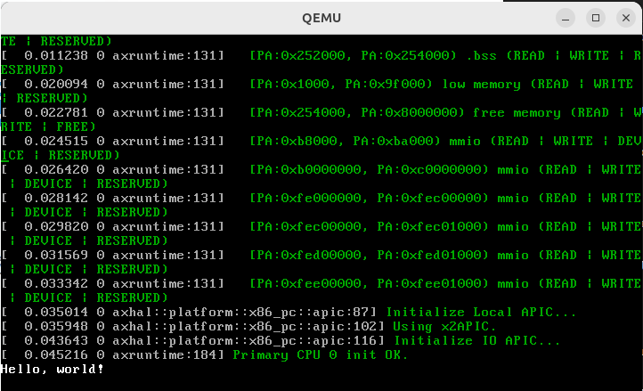
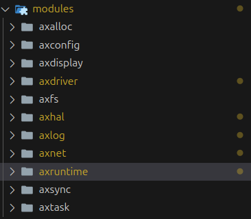

# 上手2 ArceOS VGA驱动/彩色显示（一）

## 已实现的功能复现

基于项目 https://github.com/wfly1998/arceos/tree/feature/vga

先运行查看当前已经实现的色彩显示功能，然后再进行修改。

```bash
git checkout -b feature/vga origin/feature/vga # 切换分支

make A=apps/helloworld ARCH=x86_64 LOG=trace GRAPHIC=on run # 运行

```
运行结果如下：



分析运行的命令 `make A=apps/helloworld ARCH=x86_64 LOG=trace GRAPHIC=on run`

- A=apps/helloworld 指定运行的应用程序为apps/helloworld
- ARCH=x86_64 指定运行的平台为x86_64
- LOG=trace 指定日志级别为trace
- GRAPHIC=on 指定开启图形显示

app/helloworld的应用程序比较简单，只是输出一句话，其中的代码如下：

```rust
#![cfg_attr(feature = "axstd", no_std)]
#![cfg_attr(feature = "axstd", no_main)]

#[cfg(feature = "axstd")]
use axstd::println;

#[cfg_attr(feature = "axstd", no_mangle)]
fn main() {
    println!("Hello, world!");
}
```

可以看到，这个应用程序使用的是`axstd`库。

我们给出ArceOS架构图，如下：




其中，`axstd`库是ArceOS的标准库，向上为应用提供了一些操作系统级别封装好的API基本的功能，比如`println!`。

## 实验开始前期工作

由上图ArceOS架构图可知, 我们需要在ArceOS modules 目录中添加对应的功能，同时在`axstd`标准库中添加对上层应用的支持。

ArceOS modules 目录目前的结构如下：



- `axalloc`：系统内存分配模块
- `axconfig`: 系统配置相关模块
- `axdisply`：显示模块
- `axdriver`：驱动模块
- `axfs`：文件系统模块
- `axhal`：硬件抽象层模块
- `axlog`：日志模块
- `axnet`：网络模块
- `axruntime`：运行时模块
- `axsync`：同步异步模块
- `axtask`：任务模块

ulib 目录结构如下：

- `axlibc`: C标准库相关
- `axstd`: 标准库