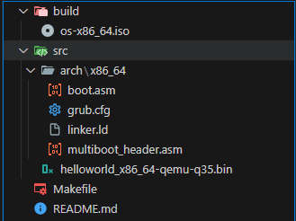
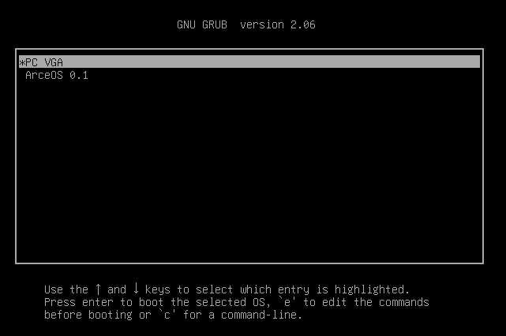
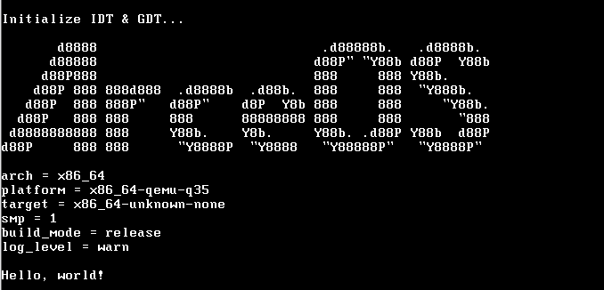
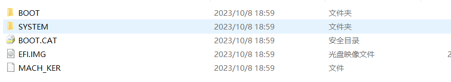
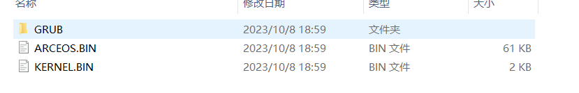

# 上手1 使用 grub启动ArceOS

## 了解 grub

GRUB，全称为 GNU GRand Unified Bootloader，是一个多操作系统的引导加载程序。它是一个开源的引导加载程序，可以用于引导多种操作系统，包括 Linux、Windows、BSD 等。

> 注：GRUB通常在操作系统安装过程中自动配置，但用户也可以手动编辑其配置文件（如grub.cfg）来调整引导选项和顺序。配置文件的位置通常在/boot/grub目录下。


## 上手

### 克隆项目

```bash
git clone https://gitee.com/chenlongos/os-x86-iso.git
```

项目结构如下图：



### S1. 直接使用已经编译好的镜像

其中，`build`目录下的`os-x86_64.iso`是已经编译好的镜像文件，可以直接使用。

> 可以选址快速烧写到U盘，然后通过U盘启动，或者使用虚拟机加载镜像文件。

我们这里选择使用虚拟机软件（如 VMware Workstation、VirtualBox）来加载镜像文件，然后启动虚拟机。

启动虚拟机后，我们可以看到如下界面：



我们使用键盘上下键选择我们要启动的操作系统，然后按`Enter`键即可。

> 同时我们可以看到，我们的键盘是可以使用的，证明了BIOS中对于键盘的初始化是成功的。

#### 选择`PC VGA`时的效果


证明了BIOS对于VGA的初始化和显示是成功的。

#### 选择`ArceOS 0.1`时的效果



### S2. 自行编译系统源码

```bash

$ make
mkdir -p build/arch/x86_64
nasm -felf64 src/arch/x86_64/boot.asm -o build/arch/x86_64/boot.o
mkdir -p build/arch/x86_64
nasm -felf64 src/arch/x86_64/multiboot_header.asm -o build/arch/x86_64/multiboot_header.o
ld -n -T src/arch/x86_64/linker.ld -o build/kernel-x86_64.bin  build/arch/x86_64/boot.o  build/arch/x86_64/multiboot_header.o

$ make iso
mkdir -p build/isofiles/boot/grub
cp build/kernel-x86_64.bin build/isofiles/boot/kernel.bin
cp src/arch/x86_64/grub.cfg build/isofiles/boot/grub
grub-mkrescue -o build/os-x86_64.iso build/isofiles 2> /dev/null
rm -r build/isofiles

$ ls -l build/os-x86_64.iso
-rw-r--r-- 1 root root 9097216 Oct  5 22:56 build/os-x86_64.iso

```
然后再使用虚拟机软件加载镜像文件，启动虚拟机即可，效果和直接使用已经编译好的镜像一样。

## 关于源码中的`grub.cfg`文件

挂载镜像文件，可以看到`grub` 已经帮我们做了很多工作，我们只需要在`grub.cfg`文件中配置一些信息即可。

具体运行的操作系统内核文件是`/BOOT/`下，




```cfg
set timeout=10                  # 设置超时时间为10秒
set default=0                   # 设置默认启动项为第一个
GRUB_TERMINAL=console           # 设置控制台输出
loadfont "unicode"              # 加载字体
set gfxmode=auto                # 设置图形模式为自动
set gfxpayload=keep             # 保持图形模式
insmod all_video                # 加载所有视频模块
insmod vbe                      # 加载VBE模块
insmod vga                      # 加载VGA模块
insmod gfxterm                  # 加载图形终端模块
terminal_output gfxterm         # 设置终端输出为图形终端

menuentry "PC VGA" {            # 添加一个菜单项
    multiboot2 /boot/kernel.bin # 设置内核文件
    boot                        # 启动
}
menuentry "ArceOS 0.1" {        # 添加一个菜单项
    multiboot /boot/arceos.bin  # 设置内核文件
    boot                        # 启动
}
```

主要是设置了超时时间、默认启动项、加载字体、设置图形模式等，然后添加了两个菜单项，分别是`PC VGA`和`ArceOS 0.1`，就是我们在GRUB引导界面看到的两个选项。

## boot.asm 汇编代码部分

代码主要是两部分，一部分是关于 PC VGA的，另一部分是关于 ArceOS的，只是简单的输出了一些信息。

### 第一部分PC VGA的代码：

```assembly
mov word [0xb8000], 0x0248 ; H
```

- mov word [0xb8000], 0x0248: 这条指令将数据 0x0248 移动到内存地址 0xb8000 所指向的位置，且数据长度为一个字（word，即2个字节）。

- 内存地址 0xb8000：

    在x86架构的计算机中，0xb8000是一个特别的内存地址，通常被用于文本模式下的显示缓冲区（video memory）。
    在文本模式下，显示缓冲区的每个字符占用2个字节：
    
    第一个字节表示ASCII字符。
    
    第二个字节表示字符属性（如颜色）。

- 数据 0x0248：

    0x0248是一个16位的值。分解成两个字节：

    0x48是ASCII码，对应字符H。

    0x02是字符属性，表示字符的颜色。常见的颜色代码中，0x02通常表示绿色（在默认的VGA配色方案中，前4位表示前景色，后4位表示背景色）。


正是这样我们在启动PC VGA时，可以看到一个绿色的Hello World!。


### 第二部分ArceOS的代码，使用中断0x10来输出字符：

:::info
中断0x10是BIOS中断服务的一部分，专门用于视频服务。在实模式下，使用这项中断可以执行各种与显示器相关的操作，如设置视频模式、控制光标、输出字符和字符串等。
:::

```assembly
; 设置字符属性（颜色）
    mov ah, 0x0e        ; 存储子功能号到寄存器 ah (0x0e 是用于 teletype 输出的功能)
    xor bh, bh          ; 将寄存器 bh 清零 (0 是默认的显示页)

    mov al, 'A'         ; 存储要显示的字符到寄存器 al
    int 0x10            ; 使用 BIOS 中断 0x10 来执行显示操作

    mov al, 'r'         ; 存储要显示的字符到寄存器 al
    int 0x10            ; 使用 BIOS 中断 0x10 来执行显示操作

    mov al, 'c'         ; 存储要显示的字符到寄存器 al
    int 0x10            ; 使用 BIOS 中断 0x10 来执行显示操作

    mov al, 'e'         ; 存储要显示的字符到寄存器 al
    int 0x10            ; 使用 BIOS 中断 0x10 来执行显示操作

    mov al, 'O'         ; 存储要显示的字符到寄存器 al
    int 0x10            ; 使用 BIOS 中断 0x10 来执行显示操作

    mov al, 'S'         ; 存储要显示的字符到寄存器 al
    int 0x10            ; 使用 BIOS 中断 0x10 来执行显示操作

    mov al, ';'         ; 存储要显示的字符到寄存器 al
    int 0x10            ; 使用 BIOS 中断 0x10 来执行显示操作

    mov esp, 0x0000c000
    mov al, '!'
    call print_char


print_char:
    xor bh, bh
    mov ah, 0x0e
    mov al, '@'
    int 0x10
    ret

    hlt
```