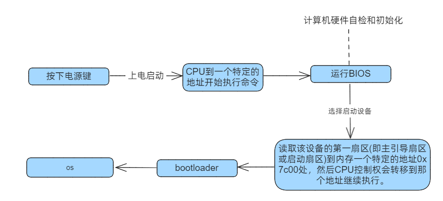
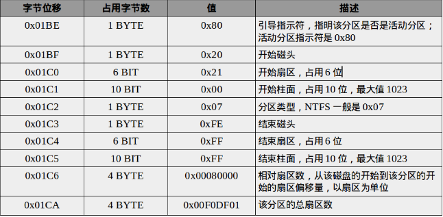

使用到的参考资料：

> - [MBR主引导扇区解析](https://www.cnblogs.com/CasonChan/p/4546658.html)

# 启动流程

> (BIOS -> MBR -> BootLoader -> Kernel)



:::info{title="BIOS基本输入输出系统"}
BIOS实际上是被固化在计算机ROM（只读存储器）芯片上的一个特殊的软件，为上层软件提供最底层的、最直接的硬件控制与支持。
:::

## ⚡上电并重置

激活CPU，所有寄存器初始化为0，勤劳的CPU开始工作。

CPU的cs:ip寄存器就会被强制初始化为0xF000:0xFFF0，就此得到BIOS的入口地址0xFFFF0。即CS=0xF000，IP=0xFFF0；

> 这块感觉不能学得太死，可能具体CPU指令集架构不同，初始化的方式也不同？

BIOS作为计算机上第一个启动的软件，是由只读存储器ROM加载的，其入口地址被固化在0xFFFF0处；

:::info
x86_CPU访问内存采用的是分段访问机制，即段地址+偏移地址；

由于在实模式下，段地址需要乘以16再和偏移地址相加，从而得到物理地址。

所以BIOS的入口地址实际上是0xF0000 + 0xFFF0 = 0xFFFF0。
:::

而0xFFFF0 ~ 0xFFFFF这16个字节的地址只是BIOS的入口地址，16个字节的地址空间肯定是不够的，所以该地址实际上存储是一个跳转指令，跳转到BIOS的实际代码段，如下：

```assembly
JMP F000:E05B
```

所以BIOS的实际执行地址是 `F000:E05B`，即CS=0xF000，IP=0xE05B => 0xF0000 + 0xE05B = 0xFE05B 处。


## 🔧 BIOS 开始执行初始化工作

当JMP到真正的BIOS区域时，BIOS开始进行初始化的工作。


- 首先自检，通过BIOS中断呼叫对硬件进行测试、初始化。如果有故障，主板会发出不同含义的蜂鸣，启动终止。
- 其次，提供基本服务。从现在开始要用到键盘和鼠标了，这些都是通过中断进行的，所以建立中断向量表和中断服务程序，在0x00000~0x003FF处建立数据结构，中断向量表并填写中断例程。
- 同时，为了显示诊断资讯或显示设定画面，需要在内存空间映射显存的空间，在显示器上显示一些字符。
- 做完自己的事情之后，开始打听操作系统的下落，寻找启动盘
- 最后一个跳转指令：JMP 0:0x7c00，将控制权交给启动盘的引导扇区。

> 检验启动盘中位于0盘0道1扇区的内容，如果此扇区末尾两个字节是0x55AA，BIOS便会认为此扇区中确实存在可执行程序，也就是主引导记录MBR，跳转到0x7c00处。


## 启动盘引导

计算机主板的BIOS程序在自检通过后，会将MBR扇区整个读取到内存中，然后将执行权交给内存中MBR扇区的引导程序

MBR Master Boot Record 主引导记录扇区，位于硬盘的第一个扇区，大小为512字节。

三部分组成：

#### 1、引导程序代码：446字节，用于加载操作系统

将该主引导扇区加载到内存中并执行前面446字节的引导程序，引导程序首先会在分区表中查找活动分区，若存在活动分区，则根据活动分区的偏移量找到该活动分区上的引导扇区的地址，并将该引导扇区加载到内存中，同时检查该引导扇区的有效性，然后根据该引导扇区的规则去引导操作系统。

#### 2、分区表：64字节，记录硬盘分区信息

分区表是磁盘管理最重要的部分，通过分区表信息来定位各个分区，访问用户数据。

分区表包含4个分区项，每一个分区项通过位置偏移、分区大小来唯一确定一个主分区或者扩展分区。

每个分区项占16字节，包括引导标识、起始和结束位置的CHS参数、分区类型、开始扇区、分区大小等，具体描述如下表所示：



这里需要注意的是，分区项的第1个字节表示该分区是否是活动分区，即是否包含系统引导扇区，用来引导操作系统。

**每个磁盘只能同时有一个活动分区，活动分区的引导指示符是0x80，其他均为0x00**；

尽管我们可以通过一些工具来手动修改引导指示符，但是引导程序只会查找并使用第一个引导指示符为0x80的活动分区。

#### 3、结束标志：2字节，0x55AA


