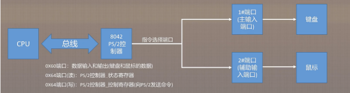

# PS/2

## PS/2基础知识

PS/2是电脑上常见的接口之一，用于鼠标、键盘等设备。一般情况下，PS/2接口的鼠标为绿色，键盘为紫色。

PS/2接口是输入装置接口，而不是传输接口。所以PS2口根本没有传输速率的概念，只有扫描速率。


## PS/2控制器的编程接口

通常，PS/2控制器的编程接口涉及以下几个寄存器：

- **数据寄存器（0x60端口）**：用于读写键盘和鼠标数据。
- **状态寄存器（0x64端口）**：用于读取控制器状态。
- **命令寄存器（0x64端口）**：用于向控制器发送命令。



### 状态寄存器各位含义

```rust
bitflags! {
    pub struct StatusFlags: u8 {
        const OUTPUT_FULL = 1;
        const INPUT_FULL = 1 << 1;
        const SYSTEM = 1 << 2;
        const COMMAND = 1 << 3;
        // Chipset specific
        const KEYBOARD_LOCK = 1 << 4;
        // Chipset specific
        const SECOND_OUTPUT_FULL = 1 << 5;
        const TIME_OUT = 1 << 6;
        const PARITY = 1 << 7;
    }
}

```

- **位 0 (Output Buffer Status)**: 当此位为 1 时，表示控制器有数据可以读取。读取数据寄存器（端口 0x60）时，应在读取前检查此位。
- **位 1 (Input Buffer Status)**: 当此位为 1 时，表示输入缓冲区已满，不应向输入缓冲区写入数据。写入数据或命令前应检查此位。
- **位 2 (System Flag)**: 该标志通常用于指示系统初始化状态。
- **位 3 (Command/Data)**: 用于区分输入缓冲区中的内容是命令还是数据。（0是数据、1是命令）
- **位 4 (Keyboard Lock)**: 表示键盘是否被锁定，用于键盘指令管理。
- **位 5 (Auxiliary Device Output Buffer Full)**: 当此位为 1 时，表示辅助设备（如鼠标）有数据可读取。
- **位 6 (Timeout Error)**: 用于指示通信超时错误。
- **位 7 (Parity Error)**: 用于指示数据传输中的奇偶校验错误。

### 配置寄存器各位含义
```rust
bitflags! {
    pub struct ConfigFlags: u8 {
        const FIRST_INTERRUPT = 1;
        const SECOND_INTERRUPT = 1 << 1;
        const POST_PASSED = 1 << 2;
        // 1 << 3 should be zero
        const CONFIG_RESERVED_3 = 1 << 3;
        const FIRST_DISABLED = 1 << 4;
        const SECOND_DISABLED = 1 << 5;
        const FIRST_TRANSLATE = 1 << 6;
        // 1 << 7 should be zero
        const CONFIG_RESERVED_7 = 1 << 7;
    }
}

```

- **位 0 (IRQ1 Enable)**:
    - **1**: 启用键盘中断（IRQ1）。
    - **0**: 禁用键盘中断（IRQ1）。
- **位 1 (IRQ12 Enable)**:
    - **1**: 启用鼠标中断（IRQ12）。
    - **0**: 禁用鼠标中断（IRQ12）。
- **位 2 (System Flag)**:
    - **1**: 系统已初始化。
    - **0**: 系统未初始化。
- **位 3 (Zero)**:
    - 必须始终为 0。
- **位 4 (Disable Keyboard)**:
    - **1**: 禁用键盘端口。
    - **0**: 启用键盘端口。
- **位 5 (Disable Mouse)**:
    - **1**: 禁用鼠标端口。
    - **0**: 启用鼠标端口。
- **位 6 (Translation Enable)**:
    - **1**: 启用扫描码转换。
    - **0**: 禁用扫描码转换。
- **位 7 (Zero)**:
    - 必须始终为 0。

### 命令寄存器各位含义

1. 通用命令

```rust
enum Command {
    ReadConfig = 0x20, // 0x20 (Read Command Byte) -返回命令字节。(参见下面的“写入命令字节”)。

    WriteConfig = 0x60, // 0x60(写命令字节)-将参数存储为命令字节。

    DisableSecond = 0xA7, //PS/2模式。类似于“禁用键盘接口”(0xAD)命令

    EnableSecond = 0xA8, // PS/2模式。类似于“使能键盘接口”(0xAE)命令。

    TestSecond = 0xA9, // 0xA9(鼠标接口测试)-如果正常返回0x00，如果时钟线卡低返回0x01，如果时钟线卡高返回0x02，如果数据线卡低返回0x03，如果数据线卡高返回0x04。

    TestController = 0xAA, // 0xAA(控制器自检)-如果可以，返回0x55。

    TestFirst = 0xAB, //0xAB(键盘接口测试)-如果正常返回0x00，如果时钟线卡低返回0x01，如果时钟线卡高返回0x02，如果数据线卡低返回0x03，如果数据线卡高返回0x04。

     Diagnostic = 0xAC, // 执行PS/2控制器的诊断命令，对应的命令字节值是0xAC。

    DisableFirst = 0xAD, //0xAD(禁用键盘接口)-设置命令字节的第4位并禁用与键盘的所有通信。

    EnableFirst = 0xAE, //0xAE(使能键盘接口)-清除命令字节的第4位并重新启用与键盘的通信。

    WriteSecond = 0xD4 // 向辅助PS/2设备发送参数。

}

```

键盘相关命令

```rust
enum KeyboardCommand {

    EnableReporting = 0xF4, // 启用键盘数据报告的命令，对应的命令字节值是 0xF4。

    SetDefaultsDisable = 0xF5, //设置默认值并禁用键盘扫描的命令，对应的命令字节值是 0xF5。

    SetDefaults = 0xF6, // 设置默认值的命令，对应的命令字节值是 0xF6。

    Reset = 0xFF //复位键盘的命令，对应的命令字节值是 0xFF。

}

// 键盘使用的是哪一个扫描码集
enum KeyboardCommandData {

    ScancodeSet = 0xF0

}

```

鼠标相关命令

```rust
enum MouseCommand {

    SetScaling1To1 = 0xE6, // 设置鼠标的移动比例为 1:1 的命令，对应的命令字节值是 0xE6。

    SetScaling2To1 = 0xE7, // 设置鼠标的移动比例为 2:1 的命令，对应的命令字节值是 0xE7。

    StatusRequest = 0xE9, // 请求鼠标状态的命令，对应的命令字节值是 0xE9。

    GetDeviceId = 0xF2, // 获取鼠标设备 ID 的命令，对应的命令字节值是 0xF2。

    EnableReporting = 0xF4, // 启用鼠标数据报告的命令，对应的命令字节值是 0xF4。

    SetDefaultsDisable = 0xF5, // 设置默认值并禁用鼠标扫描的命令，对应的命令字节值是 0xF5。

    SetDefaults = 0xF6, // 设置默认值的命令，对应的命令字节值是 0xF6。

    Reset = 0xFF // 复位鼠标的命令，对应的命令字节值是 0xFF。

}

enum MouseCommandData {

    SetResolution = 0xE8, // 设置鼠标分辨率的命令，对应的命令字节值是 0xE8。

    SetSampleRate = 0xF3, // 设置鼠标采样率的命令，对应的命令字节值是 0xF3。

}
```

## PS/2驱动程序运行的基本流程

1. **初始化PS/2控制器**
2. **检测并初始化键盘**
3. **处理键盘中断**
4. **读取键盘数据**