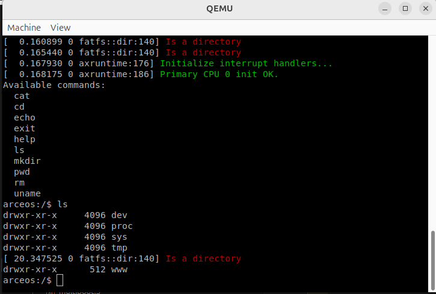
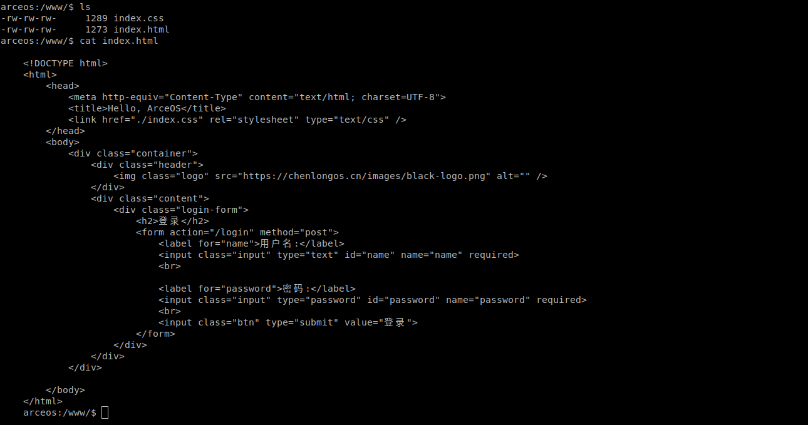

# 实验 3 文件系统分析

## ArceOS 文件系统实现

我们主要关注的模块是`axfs`，该模块下主要有两种文件系统，一种是`myfs`，另一种是`fatfs`。

```rust
// in modules/axfs/src/fs/mod.rs

cfg_if::cfg_if! {
    if #[cfg(feature = "myfs")] {
        pub mod myfs;
    } else if #[cfg(feature = "fatfs")] {
        pub mod fatfs;
    }
}
```

目前我们主要实现的是`fatfs`

我们需要在 `/axfs/src/root.rs`，下初始化根文件系统，由根文件系统初始化`fatfs`文件系统。

```rust
// in modules/axfs/src/root.rs

pub(crate) fn init_rootfs(disk: crate::dev::Disk) {
    cfg_if::cfg_if! {
        if #[cfg(feature = "myfs")] { // override the default filesystem
            let main_fs = fs::myfs::new_myfs(disk);
        } else if #[cfg(feature = "fatfs")] {
            static FAT_FS: LazyInit<Arc<fs::fatfs::FatFileSystem>> = LazyInit::new();
            FAT_FS.init_by(Arc::new(fs::fatfs::FatFileSystem::new(disk)));
            FAT_FS.init();
            let main_fs = FAT_FS.clone();
        }
    }

    let mut root_dir = RootDirectory::new(main_fs);

    #[cfg(feature = "devfs")]
    root_dir
        .mount("/dev", mounts::devfs())
        .expect("failed to mount devfs at /dev");

    #[cfg(feature = "ramfs")]
    root_dir
        .mount("/tmp", mounts::ramfs())
        .expect("failed to mount ramfs at /tmp");

    // Mount another ramfs as procfs
    #[cfg(feature = "procfs")]
    root_dir // should not fail
        .mount("/proc", mounts::procfs().unwrap())
        .expect("fail to mount procfs at /proc");

    // Mount another ramfs as sysfs
    #[cfg(feature = "sysfs")]
    root_dir // should not fail
        .mount("/sys", mounts::sysfs().unwrap())
        .expect("fail to mount sysfs at /sys");

    ROOT_DIR.init_by(Arc::new(root_dir));
    CURRENT_DIR.init_by(Mutex::new(ROOT_DIR.clone()));
    *CURRENT_DIR_PATH.lock() = "/".into();
}


```

同时`axfs/src/mounts.rs`文件中构建文件系统目录文件系统，将`/www`文件目录挂载到根目录上，完成对文件的保存。

```rust

#[cfg(feature = "ramfs")]
pub(crate) fn ramfs() -> VfsResult<Arc<fs::ramfs::RamFileSystem>> {
    let wwwfs = fs::ramfs::RamFileSystem::new();
    let www_root = wwwfs.root_dir();

    www_root.create("index.html", VfsNodeType::File)?;
    www_root.create("index.css", VfsNodeType::File)?;

    let html_file = www_root.clone().lookup("./index.html")?;
    let css_file = www_root.clone().lookup("./index.css")?;

    html_file.write_at(0, r#"
    <!DOCTYPE html>
    <html>
        <head>
            <meta http-equiv="Content-Type" content="text/html; charset=UTF-8">
            <title>Hello, ArceOS</title>
            <link href="./index.css" rel="stylesheet" type="text/css" />
        </head>
        <body>
            <div class="container">
                <div class="header">
                    
                </div>
                <div class="content">
                    <div class="login-form">
                        <h2>登录</h2>
                        <form action="/login" method="post">
                            <label for="name">用户名:</label>
                            <input class="input" type="text" id="name" name="name" required>
                            <br>

                            <label for="password">密码:</label>
                            <input class="input" type="password" id="password" name="password" required>
                            <br>
                            <input class="btn" type="submit" value="登录">
                        </form>
                    </div>
                </div>
            </div>

        </body>
    </html>
    "#.as_bytes())?;

    css_file.write_at(0, r#"
    *{
        margin: 0;
        padding: 0;
    }

    .container {
        width: 100%;
        min-height: 100vh;
        display: flex;
        flex-direction: column;
    }

    .container .header {
        box-sizing: border-box;
        height: 60px;
        display: flex;
        align-items: center;
        border-bottom: 1px solid #00000014;
    }

    .container .header .logo {
        width: 200px;
        height: 40px;
    }

    .container .content {
        flex-grow: 1;
        display: flex;
        justify-content: center;
        align-items: center;
    }

    .container .content .login-form {
        padding: 20px;
        box-sizing: border-box;
        box-shadow: 0 0 10px #00000014;
        border-radius: 12px;
    }

    .container .content .login-form .input {
        height: 30px;
        border: 1px solid #00000014;
        border-radius: 5px;
        padding: 0 10px;
        margin-top: 10px;

    }

    .container .content .login-form .btn {
        width: 100%;
        height: 30px;
        background-color: #007bff;
        color: #fff;
        border: none;
        border-radius: 5px;
        cursor: pointer;
        margin-top: 10px;
    }

    .container .content .login-form .btn:hover {
        background-color: #0056b3;
    }
    "#.as_bytes())?;

    Ok(Arc::new(wwwfs))
}
```

## 文件系统展示复现

效果如下：



使用`cat`命令查看`index.html`文件内容


