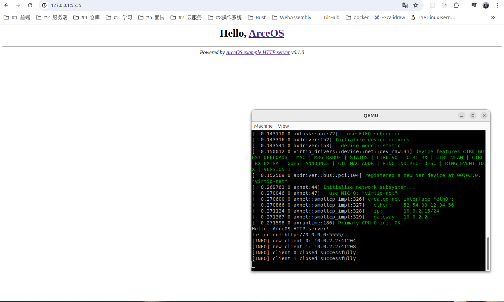
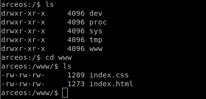
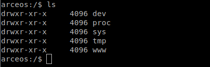
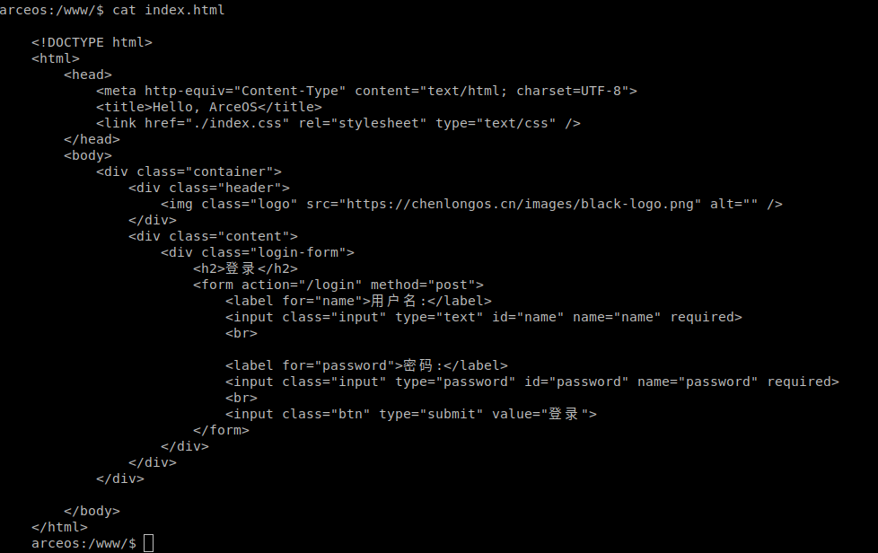
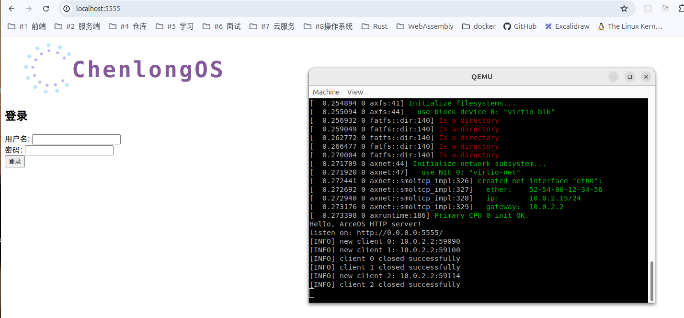
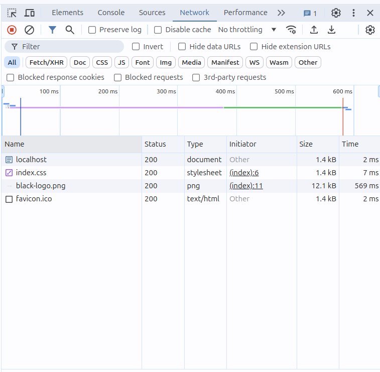
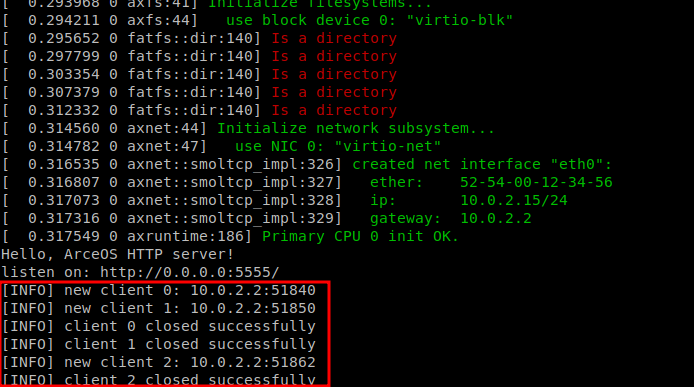

# httpserver 代码分析

## 运行 httpserver 查看效果

运行命令

```bash
make A=apps/net/httpserver ARCH=x86_64 GRAPHIC=on BLK=y NET=y LOG=info run
```

效果图：



替换以上代码中固定的内容 ，采用 fs 的 read 函数 读取 index.html 内容

当前根目录下的文件结构如下：



## 挂载`/www`、`/index.html`和`/index.css`

在`axfs`模块下的 fs 文件夹下的`root.rs`，将`/www`文件挂载到`/`文件夹下。

```rust
#[cfg(feature = "ramfs")]
    root_dir
        .mount("/www", mounts::ramfs().unwrap())
        .expect("failed to mount ramfs at /www");
```

找到`axfs`模块下的 fs 文件夹下的`mounts.rs`文件，将`/index.html`文件夹挂载到`/www`文件夹下。

```rust
#[cfg(feature = "ramfs")]
pub(crate) fn ramfs() -> VfsResult<Arc<fs::ramfs::RamFileSystem>> {
    let wwwfs = fs::ramfs::RamFileSystem::new();
    let www_root = wwwfs.root_dir();

    www_root.create("index.html", VfsNodeType::File)?;
    www_root.create("index.css", VfsNodeType::File)?;

    let html_file = www_root.clone().lookup("./index.html")?;
    let css_file = www_root.clone().lookup("./index.css")?;

    html_file.write_at(0, r#"
    <!DOCTYPE html>
    <html>
        <head>
            <meta http-equiv="Content-Type" content="text/html; charset=UTF-8">
            <title>Hello, ArceOS</title>
            <link href="./index.css" rel="stylesheet" type="text/css" />
        </head>
        <body>
            <div class="container">
                <div class="header">
                    
                </div>
                <div class="content">
                    <div class="login-form">
                        <h2>登录</h2>
                        <form action="/login" method="post">
                            <label for="name">用户名:</label>
                            <input class="input" type="text" id="name" name="name" required>
                            <br>

                            <label for="password">密码:</label>
                            <input class="input" type="password" id="password" name="password" required>
                            <br>
                            <input class="btn" type="submit" value="登录">
                        </form>
                    </div>
                </div>
            </div>

        </body>
    </html>
    "#.as_bytes())?;

    css_file.write_at(0, r#"
    *{
        margin: 0;
        padding: 0;
    }

    .container {
        width: 100%;
        min-height: 100vh;
        display: flex;
        flex-direction: column;
    }

    .container .header {
        box-sizing: border-box;
        height: 60px;
        display: flex;
        align-items: center;
        border-bottom: 1px solid #00000014;
    }

    .container .header .logo {
        width: 200px;
        height: 40px;
    }

    .container .content {
        flex-grow: 1;
        display: flex;
        justify-content: center;
        align-items: center;
    }

    .container .content .login-form {
        padding: 20px;
        box-sizing: border-box;
        box-shadow: 0 0 10px #00000014;
        border-radius: 12px;
    }

    .container .content .login-form .input {
        height: 30px;
        border: 1px solid #00000014;
        border-radius: 5px;
        padding: 0 10px;
        margin-top: 10px;

    }

    .container .content .login-form .btn {
        width: 100%;
        height: 30px;
        background-color: #007bff;
        color: #fff;
        border: none;
        border-radius: 5px;
        cursor: pointer;
        margin-top: 10px;
    }

    .container .content .login-form .btn:hover {
        background-color: #0056b3;
    }
    "#.as_bytes())?;

    Ok(Arc::new(wwwfs))
}
```

通过硬编码的方式，直接将 index.html 和 index.css 的内容写入到文件中。

根目录下已绑定`www`文件夹，在`www`文件夹中我们成功的挂载了`index.css`和`index.html`



使用`cat`指令指令查看`index.html`文件内容



## 运行与 httpserver 隔离的硬编码 html 文件

效果如下：



我们发现我们写的 html 文件被正常解析了，但是我们的 css 文件并没有被加载，这是因为我们的 css 文件并没有被加载。

我们打开浏览器的控制台，查看请求的 css 文件路径，发现请求确实是发出去了,并且我们也接受到了 css 文件，那为什么没有解析呢？




我们进一步查看，发现我们 httpserver 返回的响应头中的`Content-Type`字段被设置成`text/html`，浏览器将它解析成了 text/html，所以我们的 css 文件没有被解析。

因此我们需要将`Content-Type`字段设置成`text/css`，这样浏览器就会将其解析成 css 文件。

找到`httpserver`应用下的`main.rs`我们可以看到目前确实已经将`content-type`字段硬编码为`text/html`;

```rust
macro_rules! header {
    () => {
        "\
            HTTP/1.1 200 OK\r\n\
            Content-Type: text/html\r\n\
            Content-Length: {}\r\n\
            Connection: close\r\n\
            \r\n\
            {}"
        };
    }
```

接下来我们就需要将`content-type`字段设置成动态的，我们可以通过文件的后缀名来判断文件的类型，然后设置`content-type`字段。

封装`TcpStream`，将 TcpStream 流解析成我们自己定义的`HttpRequest`。

```rust

fn http_server(mut stream: TcpStream) -> io::Result<()> {
    let mut buf = [0u8; 4096];
    stream.read(&mut buf)?;

    let request_str = String::from_utf8_lossy(&buf);
    let request = HttpRequest::new(&request_str);

    let method = request.get_method();
    info!("Method: {}", method);

    let version = request.get_version();
    info!("Version: {}", version);

    let mut uri = request.get_path();
    info!("URI：{}", uri);

    let content_type = resolve_content_type(uri);
    info!("Content-Type: {} ", content_type);

    if uri == "/" {
        uri = "/index.html";
    }

    let content = fs::read(format!("/www/{}", uri).as_str())?;
    let content = unsafe { core::str::from_utf8_unchecked(&content) };
    let response = format!(header!(), content_type , content.len(), content);
    stream.write_all(response.as_bytes())?;
    Ok(())
}

// httpserver/http/request.rs
use core::str::Lines;
use std::string::String;
use std::string::ToString;
use std::vec::Vec;

#[derive(Debug,Clone)]
pub struct HttpRequest {
    pub method: String,
    pub path: String,
    pub version: String,
    pub headers: Vec<RequestHeader>
}

#[derive(Debug, Clone)]
pub struct RequestHeader {
    pub key: String,
    pub value: String,
}

impl RequestHeader {
    pub fn new(key: &str, value: &str) -> RequestHeader {
        RequestHeader {
            key: key.to_string(),
            value: value.to_string(),
        }
    }
}

impl HttpRequest {
    pub fn new(request: &str) -> HttpRequest {
        let mut method = String::new();
        let mut path = String::new();
        let mut version = String::new();

        let mut lines = request.lines();
        let first_line = lines.next().unwrap();
        let mut parts = first_line.split_whitespace();
        method.push_str(parts.next().unwrap());
        path.push_str(parts.next().unwrap());
        version.push_str(parts.next().unwrap());

        let headers = Self::parse_headers(&mut lines);

        HttpRequest {
            method,
            path,
            version,
            headers,
        }
    }


    fn parse_headers(lines: &mut Lines) -> Vec<RequestHeader> {

        let mut headers = Vec::new();

        for line in lines {
            let line = line.trim();
            if line.is_empty() {
                // Stop parsing headers if we encounter an empty line
                break;
            }
            let mut header_parts = line.splitn(2, ": ");
            if let (Some(key), Some(value)) = (header_parts.next(), header_parts.next()) {
                headers.push(RequestHeader::new(key, value));
            }
        }

        headers
    }

    pub fn get_path(&self) -> &str {
        &self.path
    }

    pub fn get_method(&self) -> &str {
        &self.method
    }

    pub fn get_version(&self) -> &str {
        &self.version
    }

    pub fn get_headers(&self) -> Vec<RequestHeader> {
        self.headers.clone()
    }

    pub fn get_headers_value(&self, key: &str) -> &str {
        for header in &self.headers {
            if header.key == key {
                return header.value.as_str();
            }
        }
        ""
    }

}

// httpserver/src/http/mod.rs

mod request;
mod response;

pub use request::HttpRequest;

pub fn resolve_content_type(uri: &str) -> &str {
    let content_type = match uri {
        _ if uri == "/" => "text/html",
        _ if uri.ends_with(".ico") => "text/html",
        _ if uri.ends_with(".html") => "text/html",
        _ if uri.ends_with(".css") => "text/css",
        _ if uri.ends_with(".js") => "application/javascript",
        _ if uri.ends_with(".png") => "image/png",
        _ if uri.ends_with(".jpg") => "image/jpeg",
        _ if uri.ends_with(".jpeg") => "image/jpeg",
        _ if uri.ends_with(".gif") => "image/gif",
        _ if uri.ends_with(".svg") => "image/svg+xml",
        _ => "text/plain",
    };
    content_type
}

```

运行效果如下：


